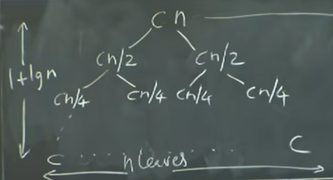

## Merge Sort:

- A divide and conquer algorithm:

      - Divide into smaller arrays
      - Compare, swap and merge

- From a top level:
      
      - Merge is going to assume we have two sorted arrays and merge it togehter.
      - Can utilize the two-pointer algorithm to merge
      - Most of the work will be done in merging part of the code
      - Rest of the body will just be a recursive call

- Here:

      - the merge step complexity - O(n)
      - Recursion takes O(log(n)) complexity

      - Total complexity O(nlog(n))
      
Note:

      In a recursion tree like this:
          Number of depth - 1 + log(n)
          Number of leaves - n
          Complexity: O(nlogn)
          

With Cn amount of work at every level hence a total of O(logn) - amount of "work" the algorithm does at every single level.

One advantage of insertion sort over merge sort:

      Insertion Sort - in-place
      
      Merge Sort - NOT in-place, needs extra space.
      

In-Place Merge Sort:
      
      - kind of  impractical
      - running time of an in-place merge sort is much worse than the regular merge sort that uses n auxiliary space.
      

Extra Notes:

       * C is much faster than python
       * But once we get above an input size of 4,000 Merge Sort in python beats the insertion sort in C
       * There are two versions of recursions:
                  * All work being done at the root
                  * All work being done at the leaves
       

These differences determine which one is the dominant part and what the complexity of the algorithm will be.

